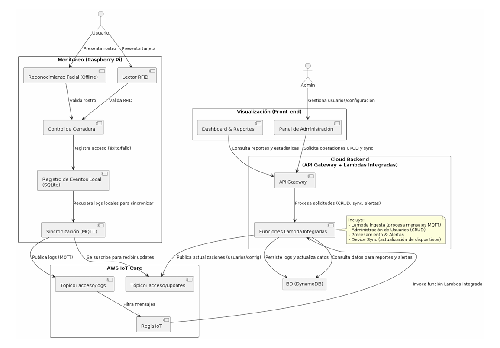

# ☁️ AWS Serverless IoT Backend for Biometric Access


**Project Type:** IoT Cloud Backend & Infrastructure
**Core Tech:** AWS IoT Core, Lambda, DynamoDB, API Gateway, MQTT.

---

## 📖 Project Overview
This repository contains the **Cloud Backend** for a distributed Biometric Access Control System. As the **Lead Backend Engineer & Project Manager**, I designed this serverless infrastructure to orchestrate the system's logic, data flow, and security.

The full system operates on a **Hybrid Edge-Cloud Architecture**, where this repository acts as the central control plane for:
* **Device Synchronization:** Keeping edge devices updated via MQTT shadows.
* **Centralized Logging:** Processing high-volume access logs via IoT Rules.
* **User Administration:** Managing permissions via a REST API.

*(Note: The embedded software running on the Raspberry Pi was developed by the hardware team and integrated via the MQTT protocols defined in this project).*

---

## 🏗️ System Architecture



### 🔄 Data Flow & Logic
1.  **Edge Processing:** The Raspberry Pi validates identity locally (Face/RFID) and controls the physical lock.
2.  **IoT Communication:** Access events are published via **MQTT** to **AWS IoT Core** (`acceso/logs`).
3.  **Cloud Ingestion:** An **IoT Rule** triggers a Python **Lambda** to process and persist the log in **DynamoDB**.
4.  **Synchronization:** When an Admin creates a user in the Dashboard:
    * Request hits **API Gateway** -> **Lambda**.
    * Lambda updates DB and publishes a message to **AWS IoT Core** (`acceso/updates`).
    * Edge devices subscribe to this topic to download new biometric signatures automatically.

---

## 🛠️ Repository Content (Cloud Layer)

This repository defines the Infrastructure as Code (IaC) for the cloud component:

| Component | Service | Function |
| :--- | :--- | :--- |
| **Broker** | AWS IoT Core | Manages bi-directional MQTT communication (Logs & Updates). |
| **Compute** | AWS Lambda (Python) | Serverless logic for Ingestion, CRUD operations, and Sync. |
| **API** | API Gateway | REST Interface for the Frontend Dashboard. |
| **Database** | Amazon DynamoDB | NoSQL storage for Users, Devices, and Access Logs. |
| **Auth** | Custom Authorizer | JWT-based security for API endpoints. |

---

## 🚀 Key Features Implemented

* **Event-Driven Architecture:** Purely trigger-based (MQTT messages & HTTP requests), incurring zero costs when idle.
* **Device Synchronization:** Implemented a "Shadow-like" pattern to keep Edge devices updated with the latest user permissions in real-time.
* **Scalable Ingestion:** Capable of handling bursts of access logs from multiple connected devices via IoT Rules.
* **Security:**
    * **JWT** for Frontend-to-Backend authentication.
    * **IAM Roles** strictly scoped for Least Privilege execution.

---

## ⚡ Deployment

This project uses the **Serverless Framework** for deployment.

```bash
# 1. Install dependencies
npm install

# 2. Deploy to AWS
serverless deploy --stage development
